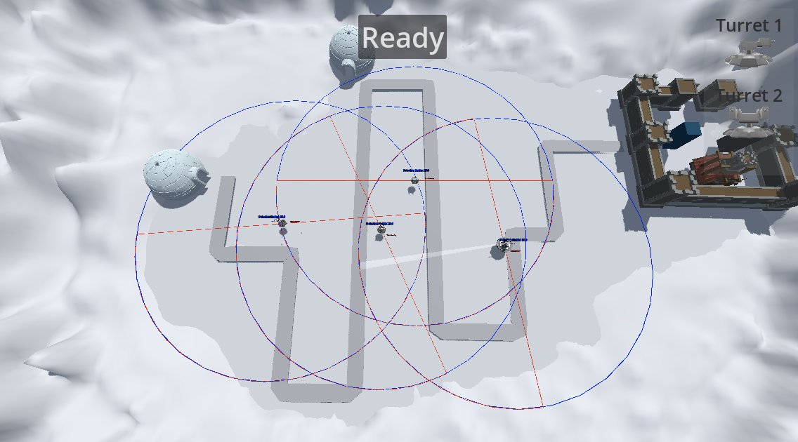
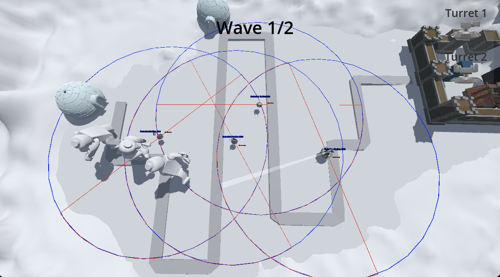

# Presskit

### Description

Penguin Patrol is a charming arctic-themed tower defense game that blends strategy, action, and a touch of frosty humor. It is set in the icy mountains, you take on the role of the Penguin Patrol leader, tasked with defending the colony's precious fish reserves from mischievous seals and cunning bears.
Armed with snowball cannons, snowball turrets, and unlockable abilities, players must strategically place defenses to outwit waves of relentless enemies. The seals are sneaky, the bears are tough, and they won’t stop until the fish is theirs! As you progress, you’ll unlock new tools and upgrades to adapt to the increasing challenges.
Join the Penguin Patrol and embark on an epic quest to protect your colony, outsmart the invaders, and save the Arctic!

### Trailer

<a href="https://drive.google.com/file/d/19Uil-7T4Sut2TmXeplA2jU7IaoMcxXmS/view" target="_blank">Trailer</a>

