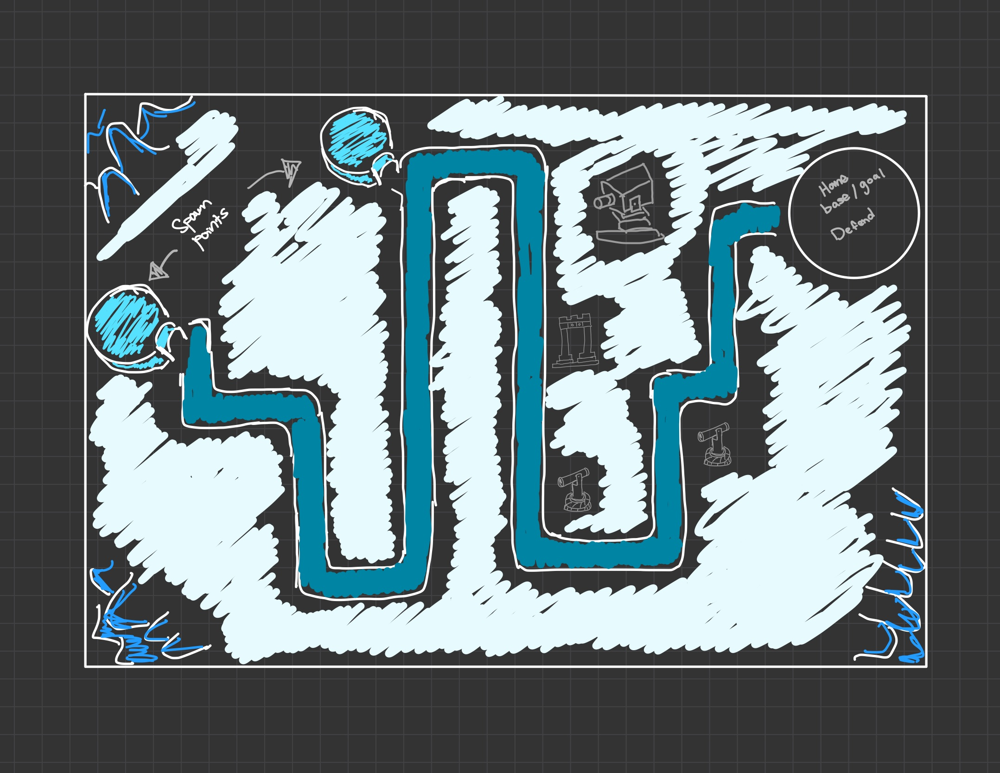
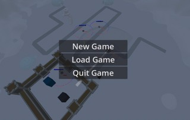
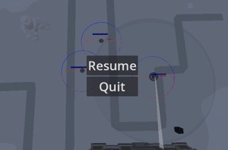

# Game Basic Information #

## Summary ##

The penguins are in trouble! Mischievous seals and bears are invading their icy home, trying to steal their fish reserves. As the leader of the penguin patrol, it’s up to you to build snow forts, fire snowball cannons, and unlock special abilities to protect the colony. But watch out! The seals and bears won’t give up easily! Get ready for a frosty adventure and defend the Arctic!

## Gameplay Explanation ##

**In this section, explain how the game should be played. Treat this as a manual within a game. Explaining the button mappings and the most optimal gameplay strategy is encouraged.**

**Add it here if you did work that should be factored into your grade but does not fit easily into the proscribed roles! Please include links to resources and descriptions of game-related material that does not fit into roles here.**

# Main Roles #

## Producer

**Describe the steps you took in your role as producer. Typical items include group scheduling mechanisms, links to meeting notes, descriptions of team logistics problems with their resolution, project organization tools (e.g., timelines, dependency/task tracking, Gantt charts, etc.), and repository management methodology.**

*Name: Cheng-yuan Liu*   
*Email: cgyliu@ucdavis.edu*   
*Github: *

## User Interface and Input

**Describe your user interface and how it relates to gameplay. This can be done via the template.**
**Describe the default input configuration.**

**Add an entry for each platform or input style your project supports.**

  

*Name: Brian Nguyen*   
*Email: btinguyen@ucdavis.edu*   
*Github: briantinnguyen*

## Movement/Physics

**Describe the basics of movement and physics in your game. Is it the standard physics model? What did you change or modify? Did you make your movement scripts that do not use the physics system?**

*Name: Penelope Phan*   
*Email: peaphan@ucdavis.edu*   
*Github: *

## Animation and Visuals

The goal for our 3D game was to create a visually coherent game that had characters, assets, and objects that flowed/worked well together. Early on, as a team we decided that we wanted our game to have a cartoonish almost Roblox-style aesthetic that is partially blocky and not overly realstic. It needed an arcade feel. I began by looking for free-to-use assets online and stubled upon poly.pizza which provides access to thousands of poly 3D models for free. This is where I found most of the asset models for our game. 

**List your assets, including their sources and licenses.**
With poly.pizza I was able to find many of the character models that we used for our game inluding:

* Pengiun - https://poly.pizza/m/9Ift-39Akov
* Turret - https://poly.pizza/m/ekTQhbJId7
* Castle - https://poly.pizza/m/opTOmcN3o9
* Igloo - https://poly.pizza/m/4CNw6ZPb4x3
* Seal - https://poly.pizza/m/45HRvXYpvUG

I downloaded these assets from poly.pizza as .glb files and imported them directly into our project under assets -> models. Here, other memebers of the group could use the assets for their portions of the game development. 

**Describe how your work intersects with game feel, graphic design, and world-building. Include your visual style guide if one exists.**

As far as building the map, we only needed to create a single map as it made the most sense for the implication of our game as a tower defense game as normally, the map stays the same with variables being number of enemies or difficulty of enemies. In addition, the map acts as a "sandbox" for the game player as they are able to add turrets and other defences to help combat the enemies so it would not made sens to rotate between different maps. 
I worked with world-building to create an icy-border for the map using a Godot-plugin called Heightmap Terrain which allowed me to construct the terrain of the map making mountain/hill terrain. 

*Name: Maxim Saschin*   
*Email: mnsaschin@ucdavis.edu*   
*Github: MaximSaschin*

## Game Logic

**Document the game states and game data you managed and the design patterns you used to complete your task.**

*Name: Qihan Guan*   
*Email: qgguan@ucdavis.edu*   
*Github: *

# Sub-Roles

## Weapons System

*Name: Qihan Guan*   
*Email: qgguan@ucdavis.edu*   
*Github: *

## Audio

**List your assets, including their sources and licenses.**

**Describe the implementation of your audio system.**

**Document the sound style.** 

*Name: Penelope Phan*   
*Email: peaphan@ucdavis.edu*   
*Github: *

## Gameplay Testing

**Add a link to the full results of your gameplay tests.**

**Summarize the key findings from your gameplay tests.**

*Name: Maxim Saschin*   
*Email: mnsaschin@ucdavis.edu*   
*Github: *

## Narrative Design

**Document how the narrative is present in the game via assets, gameplay systems, and gameplay.** 

*Name: Cheng-yuan Liu*   
*Email: cgyliu@ucdavis.edu*   
*Github: *

## Press Kit and Trailer

**Include links to your presskit materials and trailer.**

When making the trailer for Pengine Patrol: Arctic Defense, I wanted to show off the main parts of the game in a fun and simple way. The trailer starts with a quick look at the icy Arctic and the penguin colony, then jumps into gameplay. You see snowball cannons firing, penguins building forts, and seals trying to steal fish. I made sure to include special moves, like icy blasts, to show how exciting the game gets. The trailer ends with a big call to action: "Protect the Arctic!"

I picked music that felt exciting and fun, adding sound effects like snowballs hitting seals to bring it to life. For the screenshots, I chose scenes that show the coolest parts of the game—penguins fighting back, seals charging in, and the icy Arctic world. I kept it simple, making sure everything looks fun and clear for anyone who sees it.

*Name: Brian Nguyen*   
*Email: btinguyen@ucdavis.edu*   
*Github: briantinnguyen*

## Game Feel and Polish

**Document what you added to and how you tweaked your game to improve its game feel.**

*Name: Brian Nguyen*   
*Email: btinguyen@ucdavis.edu*   
*Github: briantinnguyen*

# External Code, Ideas, and Structure #

If your project contains code that: 1) your team did not write, and 2) does not fit cleanly into a role, please document it in this section. Please include the author of the code, where to find the code, and note which scripts, folders, or other files that comprise the external contribution. Additionally, include the license for the external code that permits you to use it. You do not need to include the license for code provided by the instruction team.

If you used tutorials or other intellectual guidance to create aspects of your project, include reference to that information as well.

## Project Resources

[Web-playable version of your game.](https://itch.io/)  
[Trailor](https://youtube.com)  
[Press Kit](https://dopresskit.com/)  
[Proposal: make your own copy of the linked doc.](https://docs.google.com/document/d/1qwWCpMwKJGOLQ-rRJt8G8zisCa2XHFhv6zSWars0eWM/edit?usp=sharing)  
