# Game Basic Information #

## Summary ##

The penguins are in trouble! Mischievous seals and bears are invading their icy home, trying to steal their fish reserves. As the leader of the penguin patrol, it’s up to you to build snow forts, fire snowball cannons, and unlock special abilities to protect the colony. But watch out! The seals and bears won’t give up easily! Get ready for a frosty adventure and defend the Arctic!

## Gameplay Explanation ##

The players can move around the map using `WSDA` keys and `all mouse click` buttons. To start the game player can either choose a new game to enter. Once entered, the player will set up tower defenses by selecting the turrets located in the top right corner of the screen. To start click the "Ready" button on the middle of the screen when they want the round to begin. You survive the round when all enemies are eliminated and the tower's health is in good standing. 

Movement: Move by using the keys `WSDA`. Press `W` to go forward; `S` to move backwards; `D` to go right; `A` to go left: `scroll-wheel up` to zoom in; `scrool-wheel down ` to zoom out.

Turret placement: `mouse left-click` to select anything on the UI including turret options.

Cancel: `mouse right-click` to cancel

Pause: `ESC` to pause or quit the game entirely.

# Main Roles #

## Producer

*Name: Cheng-yuan Liu*   
*Email: cgyliu@ucdavis.edu*   
*Github: *ccc2d8850

Throughout the development cycle, my role as producer focused on maintaining clear communication and project organization. Most of our day-to-day coordination happened through Discord, where we kept detailed records of technical discussions ranging from map terrain problems to enemy animation implementations and building system integrations. 
We had two crucial full-team meetings. The first was our initial planning session where we broke down the project into manageable components and assigned roles based on everyone's will - Maxim would handle animations and assets, Brian would work on UI, Penelope would focus on movement systems, and Qihan would develop turret mechanics, while I would manage the building systems and overall project coordination. The second meeting was our pre-deadline coordination session where we identified and resolved several critical integration issues between different game systems.
We conducted weekly progress check-ins between team members through Discord, tracking our adherence to the initial timeline and adjusting tasks as needed. These check-ins helped us identify potential bottlenecks early, like challenges with the building instances or animation integration issues. While we experienced a slight delay in the final week due to some complex integration challenges, the team maintained steady progress throughout most of the development cycle.
For project organization, we established a structured Git workflow that helped minimize merge conflicts despite having multiple team members working on interconnected systems. We used feature branches for major implementations and maintained clear communication about when changes were being merged into the main branch. This approach proved particularly valuable when integrating the building systems with other game components like turret placement and enemy pathing.

All our planning documentation and progress tracking can be found here:

Project timeline (inside initial gameplan): https://docs.google.com/document/d/1GZWn_SmqQvAIgVN7532S8e85JhK0-5KoybL1oGKh4r8/edit?tab=t.0 

Progress report : https://docs.google.com/document/d/1KQmFBPK5jppJ9UUhGbMz5CHWgYjXk1dk-KPUlCqqudk/edit?tab=t.0

Looking back, while there were certainly challenges in coordinating a complex game project, our structured approach to communication and project management helped us deliver a functional and integrated game experience.

## User Interface and Input

*Name: Brian Nguyen*   
*Email: btinguyen@ucdavis.edu*   
*Github: briantinnguyen*

My primary task in the development of our tower defense game focused on the user interface and input, ensuring that the game was intuitive, responsive, and enjoyable for players. One of my first responsibilities was designing a wireframe for the layout, which served as a blueprint for the game's user interface. I started by mapping out the key elements the players would need to interact with during gameplay. The layout included elements like the enemy's spawn point, the road, the end road, the overall design for the enemy path, and the town. I was responsible for creating the path.

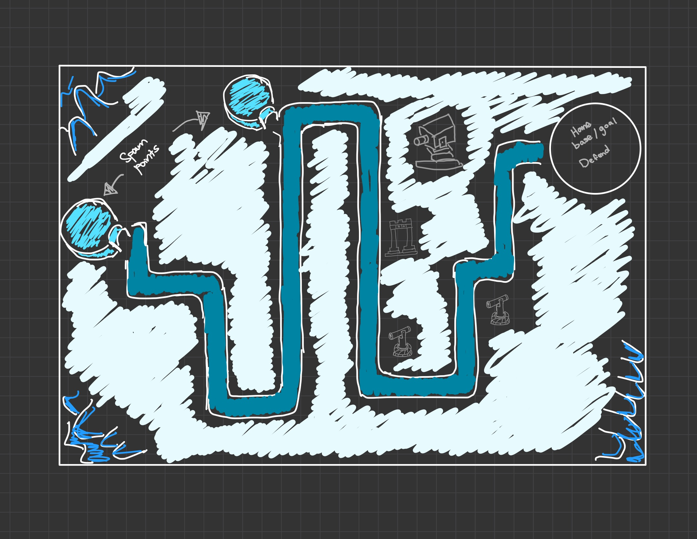

Main Menu: The main menu serves as the player's entry point to the game. It provides options such as starting a new game, loading a saved game, and exiting the game entirely. The main menu was made by duplicating the main world node, which allowed it to be implemented with a clean, intuitive user interface. In addition to the main menu, I added a 360-camera rotation around the map so that users can experience the game environment dynamically.

Pause Menu: The pause menu is implemented to provide players with essential controls during the gameplay. It is an important feature that enhances user interaction by offering options to resume or quit the game. The pause menu was built within the main node while the main menu was built by duplicating the entire environment and switching scenes once a load or new game has been selected.

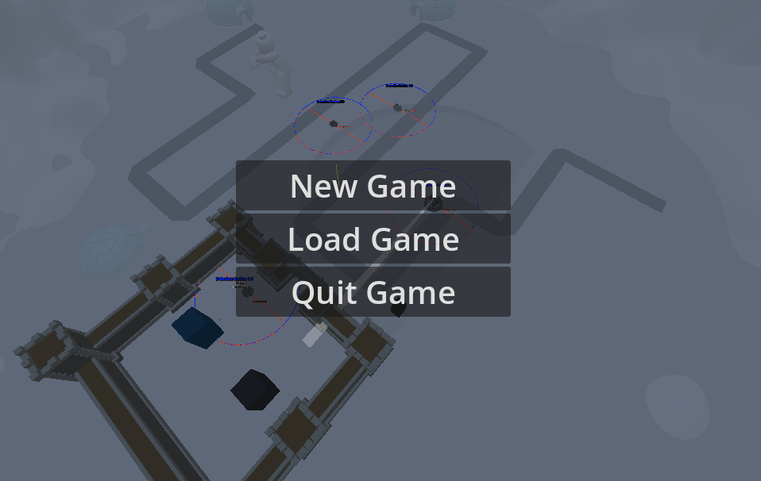 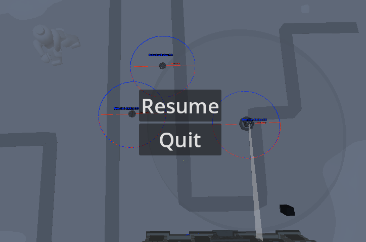

Ready: The ready function is implemented within the UI to enhance players' experience and strategy. This function activates when the player clicks on the "Ready" button on the map, triggering the start of the game and spawning the monster. This is designed to give players a fair chance to prepare their defenses before each wave. This ensures that players can come up with a strategy before each round.

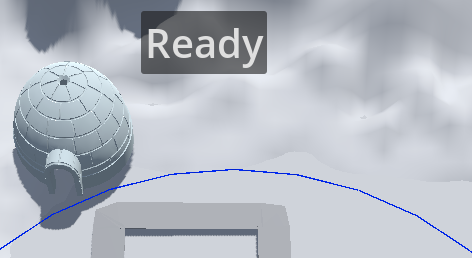 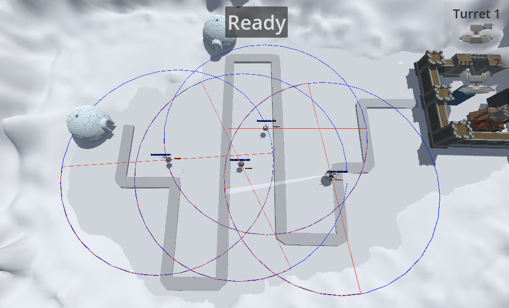

Tower Weapon HUD & Wave Indicator: The tower weapon head consists of draggable buttons on the main camera screen, allowing players to choose and place turrets during the game. This feature enhances the gameplay by allowing the players to select and place turrets before and during the waves. The turret buttons are placed on the top right screen to ensure players' visibility. The draggable functionality makes it easier for players to position their turret exactly where they want. The wave indicator was implemented to notify players the difficulty of the level and for them to plan accordingly when placing turrets.

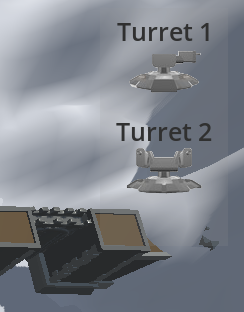 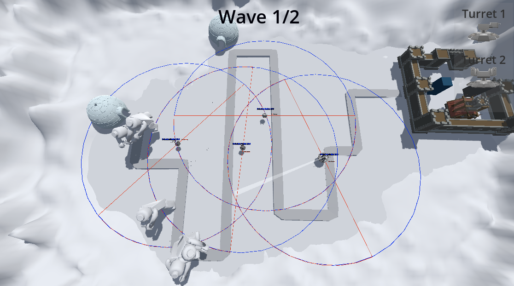

In addition to the UI responsibilities, I also implemented the game's top-down view and input controls. The top-down view is crucial for giving players a clear perspective of the tower defense and, fundamentally, the players use the top-down view angle. I positioned the camera so that it also ensures that it captures the entire play of the area while maintaining the game's arctic theme. For the input controls, the focus was to create a smooth and intuitive experience for navigating the map. WSDA keys were the main controls for camera movement. The mouse scroll wheel is for zooming in and out. The camera boundaries were also set up to ensure that players do not leave the designated game environment.

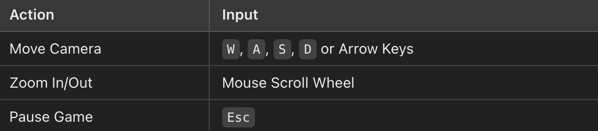

### Note:

I took the initiative to draft and write the initial game plan, progress report, and setup documentation (summary & gameplay explaination) for our project. Additionally, I helped facilitate team collaboration by organizing meetings through Discord voice and text chats, ensuring communication and coordination among group members.

## Movement/Physics

**Describe the basics of movement and physics in your game. Is it the standard physics model? What did you change or modify? Did you make your movement scripts that do not use the physics system?**

*Name: Penelope Phan*   
*Email: peaphan@ucdavis.edu*   
*Github: penelp

Movement:

The end objective for movement was to have only the enemy penguins to move down a fixed path, much like the game Bloons. To do this, I worked with Qihan in developing a durative command list to include, walking, running, attacking, left and right. I created the base code for the durative commands for all the movements and as you can see below, Qihan took over a portion of my role to edit my durative command scripts in order for them to work with the type of 3D animation models and bone models that we had, as they were quite finiicky to work with. The way the path is constructed is through a durative timer, indicating how long the zombie should walk to reach the end of the path. As you can see in ZombieWalkScript.gd, Me and Qihan worked together to work around how to deal with the 3D model, the solution we settled on was to have me create a set walk list according to the path that Maxim would create. The biggest hurdle I had with this was figuring out how to work out all the timers with the animations, since they wouldnt wait for one another to finish. I had decided to use both the timer, as well as a signal "complete"  being emitted from each movmement class after each animation was finished.

Much like Bloons, the enemies walk in a fixed spawn amount, with X amount of waves that the player has to fight through, for simplicity, we had chosen to do 2 waves. With the difficulty ramping up on second wave, by doubling the amount of enemies spawned from the first wave. Both the wave and the spawning system work on a timer, in which the player has to finish off the currently spawned enemies in order to start the new wave.

Physics:

The 3D models use a collisionBody3D that can be detected by the turrets implemented by Qihan, if the Zombies are able to reach the end of their path, the collision body will be detected by the wall's collision check, initiating a Game Over sequence. They are also able to take damage by decrementing the damage given by turrets using an area3d method check to measure if their body is in the turret lock group. My biggest issue from implementing the physics was dealing with the hierarchy that the zombie 3D model had, since making new hit and hurt boxes would affect the way the turret would target the zombie, so the hit box had to be attached to the base character3d body itself, with us doing away with the hurt box in favor of a insta lose once the zombies reach the castle.

## Animation and Visuals

### 3D Models and Assets

The objective for our 3D game was to create a visually cohesive experience where the characters, assets, and objects complemented each other seamlessly. As a team, we decided on an arctic-themed tower defense game in which penguins defend their precious supply of fish against waves of enemies, including seals and polar bears. From the start, we envisioned a cartoonish, Roblox-inspired aesthetic—partially blocky, colorful, and intentionally unrealistic—to give the game an arcade feel.

To bring this vision to life, I began searching for free-to-use assets online. During this process, I discovered [poly.pizza](https://poly.pizza/), a great resource offering thousands of free, high-quality poly 3D models. This platform became my go-to in sourcing most of the asset models for our game, from characters to environmental elements. By leveraging these assets, we were able to achieve a consistent and playful visual style that aligned with our creative direction and gameplay mechanics.

With poly.pizza I was able to find many of the character models and environmental assets that we used for our game inluding:

* Penguin - https://poly.pizza/m/2GSHsxaDIo
* Turret - https://poly.pizza/m/ekTQhbJId7 
* Castle - https://poly.pizza/m/opTOmcN3o9 
* Igloo - https://poly.pizza/m/4CNw6ZPb4x3
* Tree - https://poly.pizza/m/3pWKPFASEn-

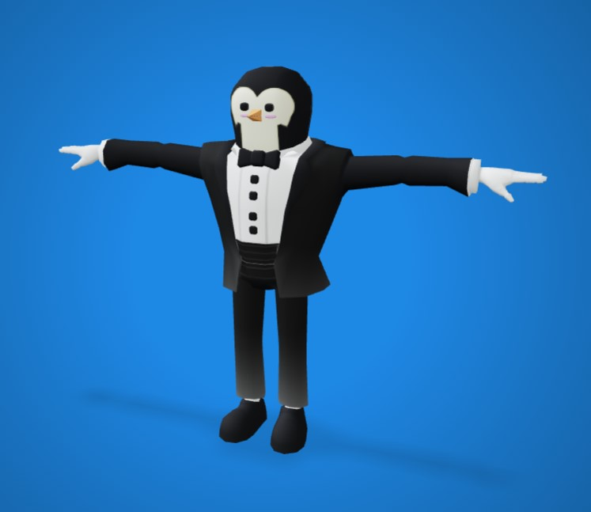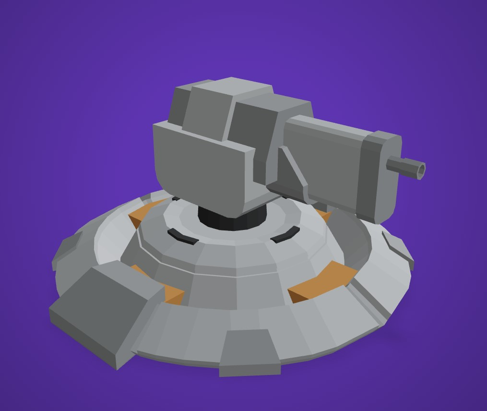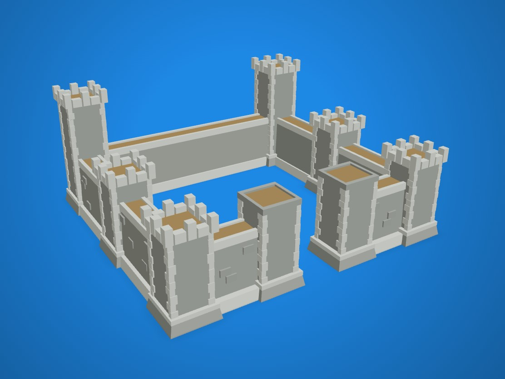
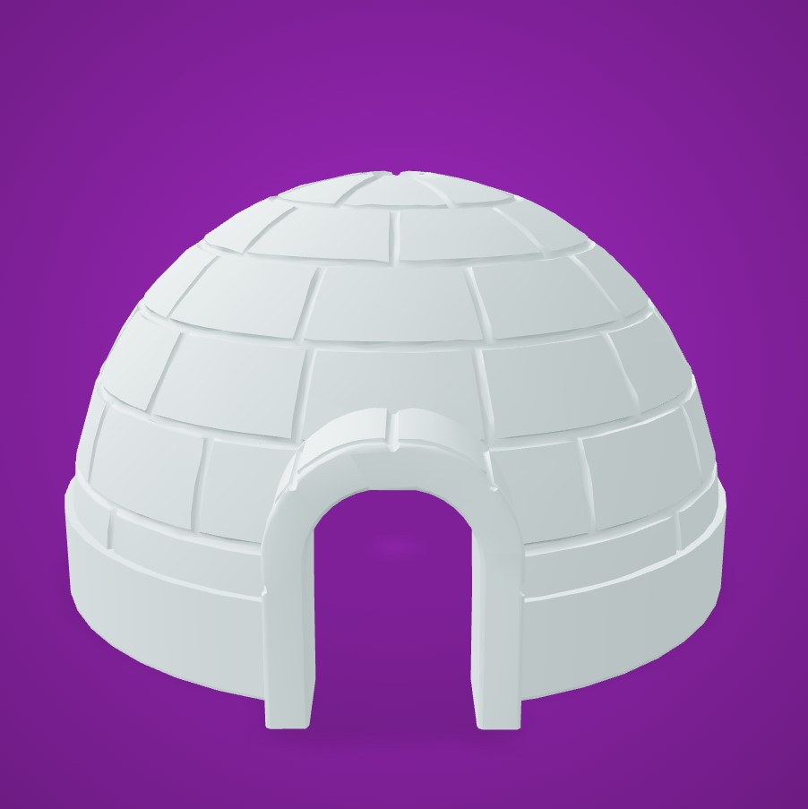

I downloaded these assets from poly.pizza as .glb files and imported them directly into our project under assets -> models. Here, other members of the group could drag the models/assets into the world and use them for their portions of the game development. From this point, I started working on the animations for the moving characters.

### Animation

I have limited experience animating 2D sprites and no prior experience animating 3D models or assets. However, I used a program called [Maximo](https://www.mixamo.com/), which simplifies the 3D animation process significantly. I started by importing a character asset from poly.pizza and positioned joints at key areas such as the knees, wrists, chin, and groin of the 3D model. Mixamo then automatically rigged the model by adding a skeleton with weight. From this point, I was able to apply animations to the model such as running, walking, dying, and more.

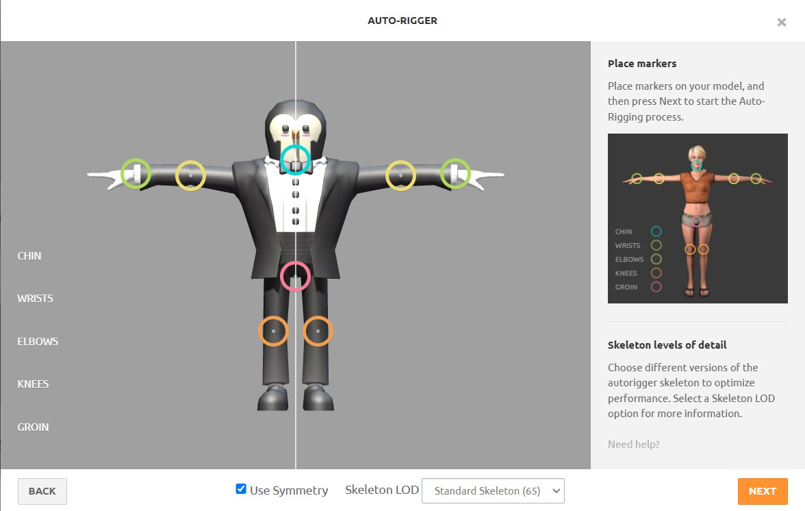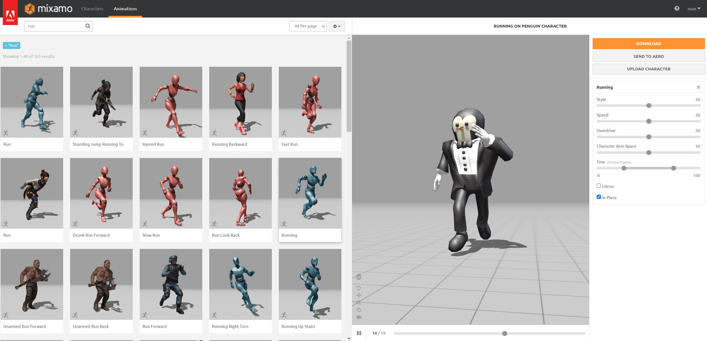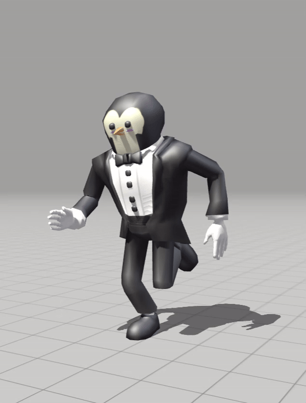

Since Mixamo is designed to work for human-like characters, the animations are tailored to mimic human movements rather than animals. To work around this limitation, I selected a humanoid penguin character from poly.pizza to ensure the animations looked correct. Given the tight time constraints, this approach was the most efficient solution for animating the character.

If I had more time, I would have explored creating custom rigs and animations in Blender. This would have allowed me to animate non-humanoid characters, such as four-legged animals, expanding the possibilities for the game.

### Map/World-Building

When designing the map for our game, we decided to create a single, as it aligned well with the mechanics and objectives of our tower defense gameplay. In most tower defense games, the map remains constant while the variables—such as the number of enemies, their difficulty, or their spawn frequency—change over time. Additionally, the map almost serves as a "sandbox" for players, providing a space where they can strategically place turrets and defenses to combat waves of enemies. Switching between maps as the game progresses would have disrupted this core gameplay loop and eliminated the strategic depth we wanted to offer.

As I helped with the world-building, I was responsible for crafting the icy terrain and adding environmental details to bring our arctic theme to life. I used a Godot plugin called [Heightmap Terrain](https://godotengine.org/asset-library/asset/231) to sculpt the landscape, creating mountain ridges and hill-like terrain to serve as natural borders for the map. Beyond shaping the terrain, I positioned several 3D models, such as an igloo where the enemies spawn, a castle that the enemies are trying to attack, and other structures, to define the map's visual identity and strategic points. To enhance the game's overall feel, I incorporated smaller details like scattered trees, ice walls, and other environmental elements, creating a visually engaging and immersive arctic battlefield. These touches not only improved the map's aesthetic but also contributed to the game's atmosphere, hopefully making it more enjoyable and memorable for players.

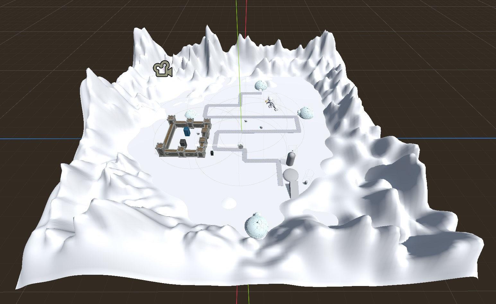

*Name: Maxim Saschin*   
*Email: mnsaschin@ucdavis.edu*   
*Github: MaximSaschin*

## Game Logic

**Document the game states and game data you managed and the design patterns you used to complete your task.**

*Name: Qihan Guan*   
*Email: qgguan@ucdavis.edu*   
*Github: *

My role initially included handling the enemy and unit(turret) behaviors, but it became a broader role in the overall Game logic. I first implemented yaw rotation (horizontal) using basic vector math, using dot product to find the angle between the turret's forward vector and target vector, cross product's Y component, and using the sign to determine rotation direction (clockwise/counterclockwise). The next challenge was adding pitch rotation (vertical) and handling both axes concurrently and seamlessly with respect to the turret design. Which required me to change my initial approach from a simple vector-math based to a more complex approach that could handle both rotational axes simultaneously. Eventually, I learned that I could put separate pivot points on the turret model to handle the yaw rotations and pitch rotations separately. And use arctangent calculations for pitch angles. And implemented angle constraints for the turret's movements to remain realistic and within its design limitations.

After this, I spent time refining the turret movements, implementing more features/modes,  adding more debugging features, and making it more modular for other members to approach and modify. Then finally implementing it on the turret models provided by Maxim, it was a bit challenging as the model meshes only have two parts, the base and top. But I was able to make it work with some tricks.

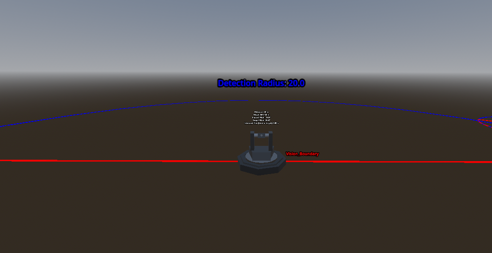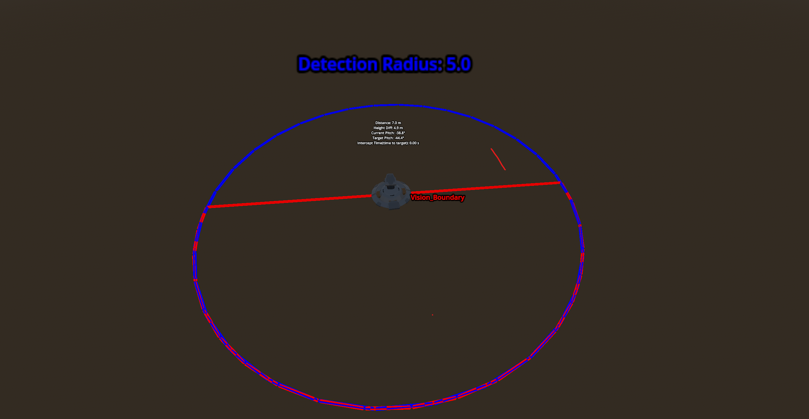

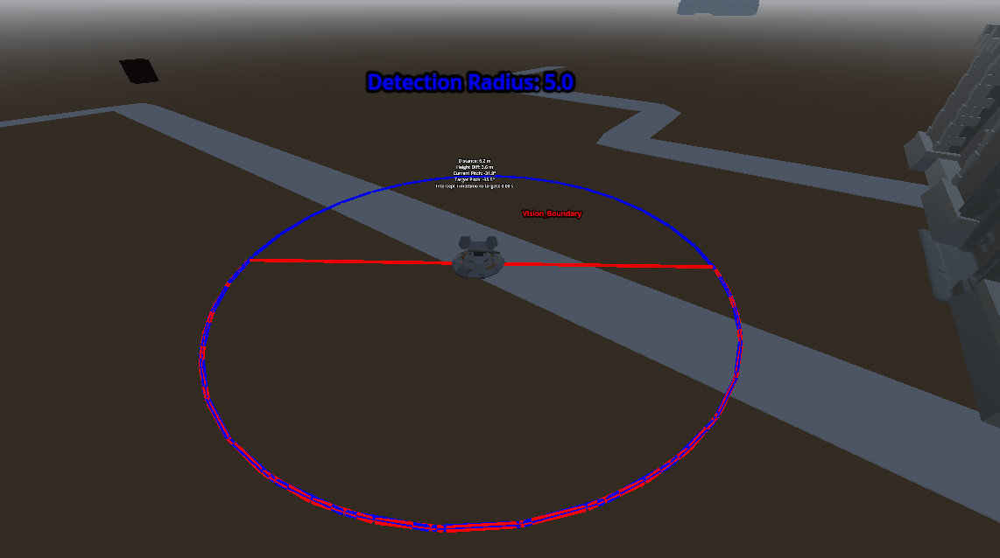

Next, I implemented the durative movement commands for the enemies, initially, this was Penelope Phan's role but we decided to switch and she provided me with the initial template/implementation. But we didn't have our enemy model yet, So I found a Lego model to use as zombies and used Adobe Mixamo to do the auto-rigging. Getting this set up in Godot was trickier than I expected, I hadn't done much with animations/designs before, so I spent quite a bit of time figuring out how to properly structure the scene and model to work with the animations. The biggest headache was fixing issues where the meshes and skeleton transforms didn't line up correctly, especially during animations. Once I got past those hurdles I was able to use my experience from exercise 1 to implement the durative cmds scripts for the zombie movement. The main challenge was handling transitions during animation replays, especially for the walk animation. The starting position didn’t match the ending position, which caused a noticeable reset when the animation looped. After some time I  discovered I could disable translation to keep the character in place while playing the animation

disabling the transformation.

Then I work with Cheng Yuan to implement the building/town scripts. Given the time constraint, we decided to keep it simple. The research building passively upgrades turret attributes as long as its health remains above 20%. But only newly spawned turrets inherit these upgrades. The production building spawns turrets at predefined fortress points, tracking availability and only spawning at unoccupied locations.

*Name: Cheng-yuan Liu*   
*Email: cgyliu@ucdavis.edu*   
*Github: *ccc2d8850

As a core developer for the building and management systems, I implemented several critical gameplay features that form the foundation of our tower defense game. I developed a comprehensive building system that manages our defensive structures, including factories, research facilities, defensive walls, and the main castle. Each building type has its own unique role: factories handle turret production with different tiers of units, research buildings provide upgrades and technological advancement, and the defensive walls protect against enemy attacks with upgradeable damage reduction.
The resource management system integrates deeply with these buildings. I implemented systems for resource generation, building costs, upgrade paths, and economy balancing. Research buildings provide strategic options through a multi-tier upgrade system that enhances turret capabilities and building performance. The factory building manages turret production with multiple unit types, each benefiting differently from research upgrades through a multiplier system (1.0x for basic turrets, up to 1.5x for advanced models).
One of my biggest challenges was creating an effective game state management system. I developed a game manager that handles everything from game initialization to victory/defeat conditions, wave progression, and resource distribution. The building damage system ties into this, with each structure having its own health pool and the potential to affect game outcome if critical buildings are destroyed. Despite some technical challenges with node hierarchies and collision detection, the final system provides players with meaningful strategic choices in base development and defense.
For example scripts demonstrating this work:

gdscriptCopy :

# From game_manager.gd

var resource_cap: float = 5000.0
var weapon_damage_multiplier: float = 1.0

func upgrade_weapons() -> void:
    weapon_damage_multiplier += weapon_damage_increase
    print("Weapons upgraded! New multiplier: ", weapon_damage_multiplier)

# From factory.gd

func spawn_turret(turret_type: int = 0) -> void:
    if current_health <= 0 or !is_operational:
        return
        
    var turret_scene: PackedScene
    match turret_type:
        0: turret_scene = Turret_prototype
        1: turret_scene = Turret_1
        2: turret_scene = Turret_2

The system's modular design allows for easy expansion, though time constraints meant leaving some planned features (like wall-mounted turrets) for future development. Despite these limitations, the building and management systems form the core of our gameplay loop, giving players strategic depth through resource management and base development choices.

#### assets:
Lego" (https://skfb.ly/MEGs) by Jody_Hong 
(http://creativecommons.org/licenses/by/4.0/). Rigging and animations by Adobe mixamo

# Sub-Roles

## Weapons System/ Debugging

*Name: Qihan Guan*   
*Email: qgguan@ucdavis.edu*   
*Github: *

My sub role is practically the same as my main, the general game logic and mechanics. This involves debugging scripts or fixing scenes.

## Audio

*Name: Penelope Phan*   
*Email: peaphan@ucdavis.edu*   
*Github: penelp

**List your assets, including their sources and licenses.**

Free music game loop bundle 
- https://tallbeard.itch.io/music-loop-bundle 

    License 
    
    - http://creativecommons.org/publicdomain/zero/1.0/

16 bit sound effects (planned for hit damage to wall) 
 - https://jdwasabi.itch.io/8-bit-16-bit-sound-effects-pack
  
    -No licenses listed but author: https://jdwasabi.itch.io/
  
Retro 32 bit game sounds for select and shoot
 - https://brainzplayz.itch.io/retro-sounds-32-bit 
    
    Licsense
     - https://itch.io/game-assets/assets-cc0

**Describe the implementation of your audio system.**

I plan to have background music playing throughout the game, the general theme is to just have the player's mind engaged since it's a bit of a slwo paced game, I wanted to choose faster paced music. I plan to implement the game sounds similar to Homework 1 implementations using the callback command to play a sound when an animation play. To reduce redundancy, I am planning to implement a death sound and a turret sound so that the sounds of enemies walking doesn't overwhelm the player.

**Document the sound style.** 

I decided to go for an 8-bit retro sound to the game, since when we first pitched the game being a Bloons-like game set in the snow, I wanted it to have a cutsey-arcade-like feel, with the 32-bit effects making the game sound colder, giving it a winter-y feel.

## Gameplay Testing

link to the full results of my gameplay tests:

[Observations and Playtester Comments](imgs/Observations_and_Playtester_Comments.pdf)

If the above link doesnt work, use [this.](https://docs.google.com/document/d/1McdCzd97ztOlwoe2JsPKGTWa_Gw12a06_F6TKWtnmdQ/edit?usp=sharing)

### Playtesting Feedback Summary

During playtesting sessions, two players provided feedback on various aspects of the game. While they appreciated the foundational concept and visual elements, several areas for improvement were identified.

Key Observations: 
Game Concept & Visuals: Players liked the arctic theme, 3D visuals, and tower-defense style, which were described as engaging. However, both agreed that the gameplay felt basic and lacked depth.

Clarity & Objectives:

The objective of defending the castle from zombies was generally understood, but players noted a lack of clear instructions or a tutorial, causing initial confusion. One player wasn’t sure how to place turrets, while another didn’t immediately understand the game’s goal. Gameplay Mechanics:

Players found the mechanics intuitive but limited, with repetitive gameplay and a lack of variety in turrets, enemies, and abilities. Suggestions included adding more rounds, diverse mechanics, and narrative elements similar to games like Plants vs. Zombies. Bugs & Errors:

Zombies occasionally walked off the map or didn’t damage the castle, breaking immersion. The animations for zombies changing direction felt clunky. User Interface & Controls:

Theming of buttons didn’t fully match the game’s aesthetic. A tutorial screen with controls and game rules was requested for better onboarding. The high camera angle made gameplay difficult to follow.

Suggested Improvements:

* Gameplay Enhancements: Add more turrets, enemy types, abilities, and longer rounds to increase complexity and engagement. Incorporate a story or narrative for a more cohesive experience.
* Bug Fixes: Ensure zombies behave as intended and can damage the castle. Address animation clunkiness.
* Onboarding: Create a tutorial or onboarding screen to explain controls, rules, and objectives clearly.
* Polish: Refine user interface elements to match the game’s theme, and adjust the camera for better visibility.
* Replayability: Introduce new mechanics to prevent repetitiveness and enhance long-term player interest.
* Target Audience: The game is aimed at fans of tower defense games, especially kids and teenagers, due to its simplicity.

With these improvements, playtesters agreed the game has strong potential to deliver a more enjoyable and polished experience.

*Name: Maxim Saschin*   
*Email: mnsaschin@ucdavis.edu*   
*Github: MaximSaschin*

## Narrative Design

**Document how the narrative is present in the game via assets, gameplay systems, and gameplay.** 

*Name: Cheng-yuan Liu*   
*Email: cgyliu@ucdavis.edu*   
*Github: *ccc2d8850

We kept the story pretty simple since the game is straightforward. Instead of having a detailed narrative, we let the arctic environment and assets (like igloos and penguins) tell the story. Players can jump right in and understand what's going on without needing much explanation. You'll find the basic background in our game summary, which gives players just enough context to know what they're fighting for.

## Game Feel and Polish

*Name: Brian Nguyen*   
*Email: btinguyen@ucdavis.edu*   
*Github: briantinnguyen*

For game feel, one of the key improvements I made was addressing the brightness issue in the game. Initially, the game environment was too dark, which made it difficult for players to see the map and its contents. To fix this issue, I added a sun scene to enhance the lighting giving the game a more aesthetically pleasing environment. 

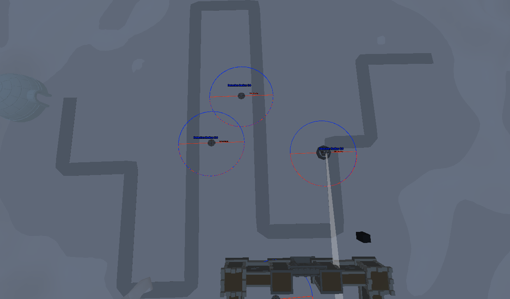 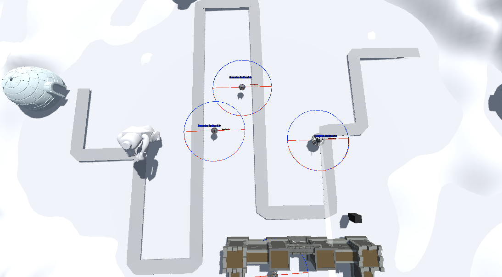 

Additionally, I worked on positioning key structures like igloos, and our defense tower ensuring they all fit into their correct positions. I was responsible for creating the path and made improvements by cleaning up the terrain's blockage. The terrain was improved by smoothing out the surfaced, layering, and removing.

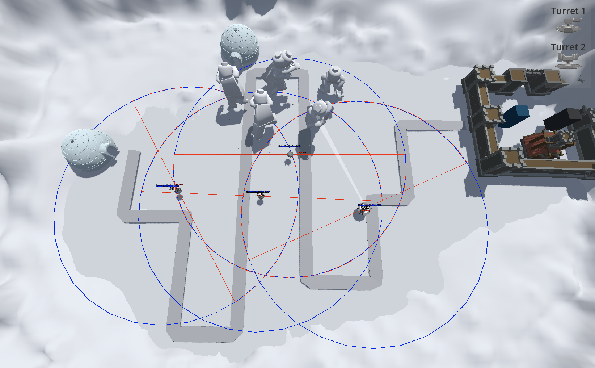

## Press Kit and Trailer

*Name: Brian Nguyen*   
*Email: btinguyen@ucdavis.edu*   
*Github: briantinnguyen*

*Name: Penelope Phan*   
*Email: peaphan@ucdavis.edu*   
*Github: penelp

When making the trailer for Penguin Patrol: Arctic Defense, We wanted to show off the main parts of the game in a fun and simple way. The trailer starts with a quick look at the icy Arctic menu, then jumps into gameplay when you hit "New Game. When you click "Ready" on the main screen you see snowball cannons firing, penguins building forts, and seals trying to steal fish. Well...at least we tried to. Unfortunately due to the time constraints and schedules for our team, the game is left feeling unfinished.

Penelope picked music that felt exciting and fun, adding sound effects like snowballs hitting seals to bring it to life. For the screenshots, We chose scenes that show the coolest parts of the game. We kept it simple, making sure everything looked fun and clear for anyone who saw it.

[Trailer](https://drive.google.com/file/d/19Uil-7T4Sut2TmXeplA2jU7IaoMcxXmS/view)

[Presskit](https://github.com/QihanQG/ECS-179-Final-Project/blob/recovered-branch/Presskit.md)

[itch](https://penelp.itch.io/arctic-tower-defense)  
