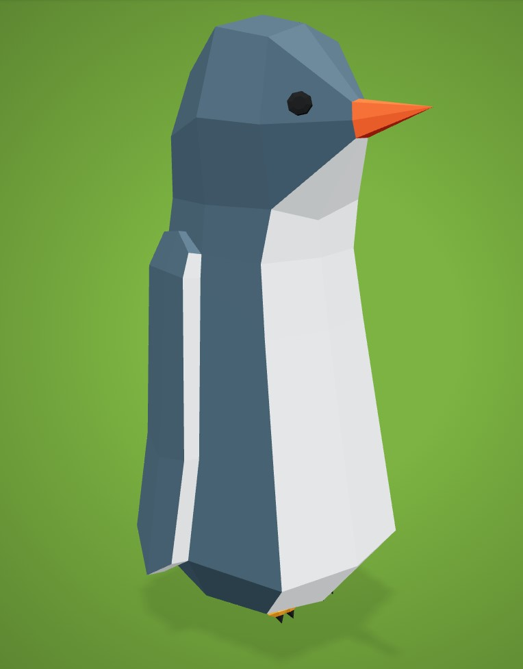
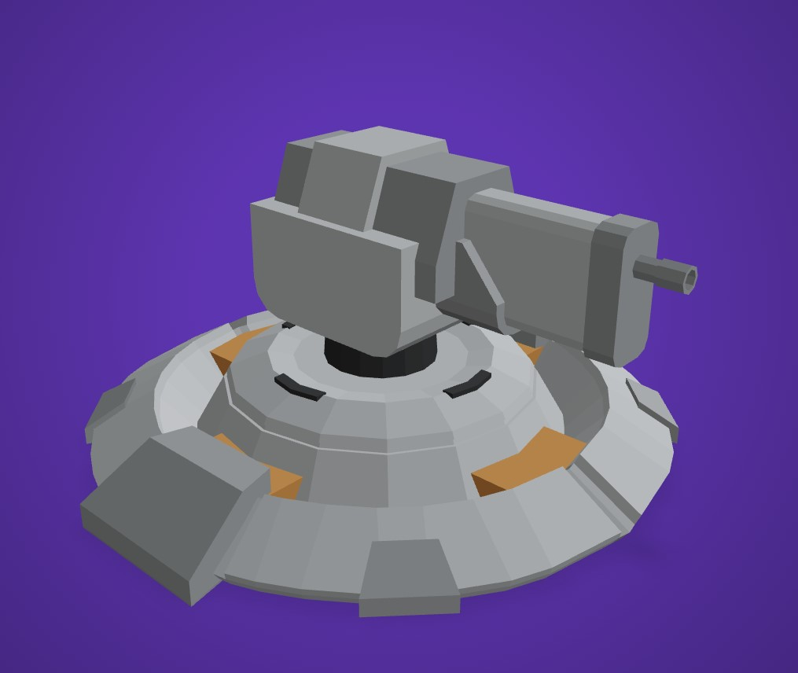
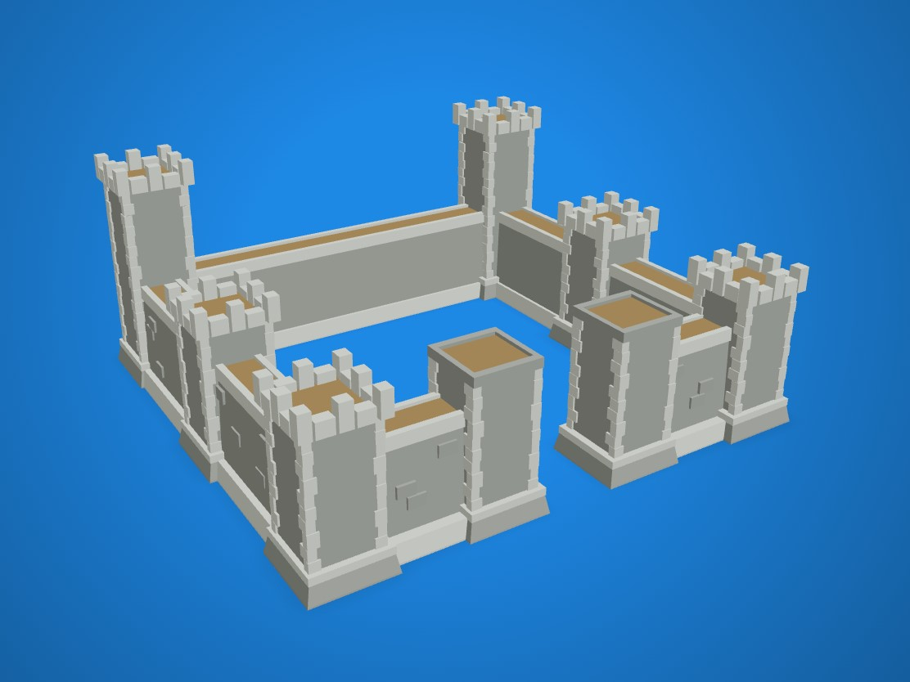
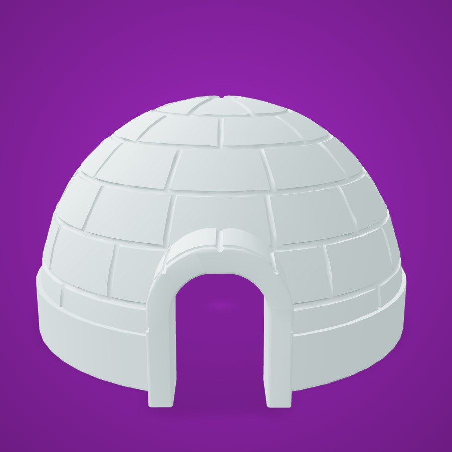
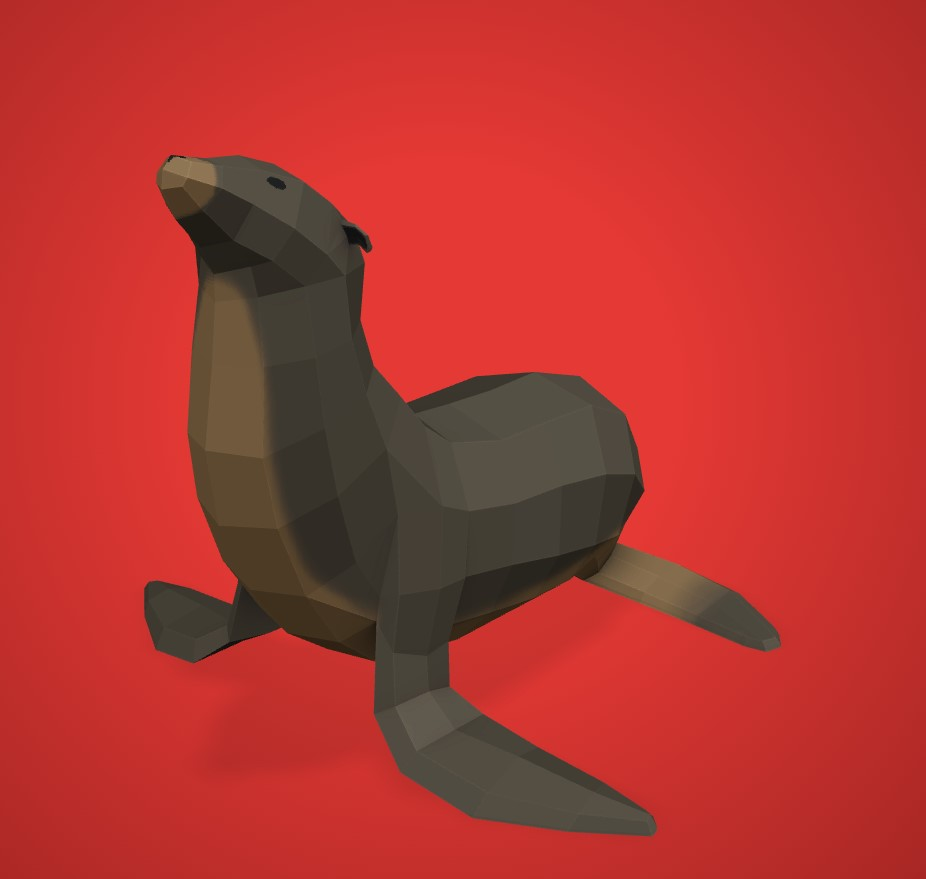

# Game Basic Information #

## Summary ##

The penguins are in trouble! Mischievous seals and bears are invading their icy home, trying to steal their fish reserves. As the leader of the penguin patrol, it’s up to you to build snow forts, fire snowball cannons, and unlock special abilities to protect the colony. But watch out! The seals and bears won’t give up easily! Get ready for a frosty adventure and defend the Arctic!

## Gameplay Explanation ##

**In this section, explain how the game should be played. Treat this as a manual within a game. Explaining the button mappings and the most optimal gameplay strategy is encouraged.**

**Add it here if you did work that should be factored into your grade but does not fit easily into the proscribed roles! Please include links to resources and descriptions of game-related material that does not fit into roles here.**

# Main Roles #

## Producer

**Describe the steps you took in your role as producer. Typical items include group scheduling mechanisms, links to meeting notes, descriptions of team logistics problems with their resolution, project organization tools (e.g., timelines, dependency/task tracking, Gantt charts, etc.), and repository management methodology.**

*Name: Cheng-yuan Liu*   
*Email: cgyliu@ucdavis.edu*   
*Github: *

## User Interface and Input

*Name: Brian Nguyen*   
*Email: btinguyen@ucdavis.edu*   
*Github: briantinnguyen*

My primary task in the development of our tower defense game focused on the user interface and input, ensuring that the game was intuitive, responsive, and enjoyable for players. One of my first responsibilities was designing a wireframe for the layout, which served as a blueprint for the game's user interface. I started by mapping out the key elements the players would need to interact with during gameplay. The layout included elements like the enemy's spawn point, the road, the end road, and the overall design for the enemy path. This layout not only provided a clear structure for the game world but also helped guide groupmates in their respective task. 

I created the main menu, which serves as the starting point for the game. It provides options for starting a new game, loading, and quitting the game. I also created the pause menu that provides players with basic game session options. The menu includes the ability to resume the game or quit the game entirely. This menu enhances the overall user experience. 

 

In addition to designing the main and pause menus, I also implemented the game's top-down view and input controls. The top-down view was crucial for giving players a clear perspective of the tower defense game, this allows them to strategize effectively and place towers. I positioned the camera to ensure it captures the entire play while maintaining the game's arctic theme. For the input controls, I focused on creating a smooth experience for navigating the map. I implemented WASD camera movement, mouse scrolling for zoom, and camera boundary restriction to ensure the user doesn't go off the map. These controls were designed to be responsive and user-friendly.

## Movement/Physics

**Describe the basics of movement and physics in your game. Is it the standard physics model? What did you change or modify? Did you make your movement scripts that do not use the physics system?**

*Name: Penelope Phan*   
*Email: peaphan@ucdavis.edu*   
*Github: *

## Animation and Visuals

The goal for our 3D game was to create a visually coherent game that had characters, assets, and objects that flowed/worked well together. As a team we decided to create an arctic-themed tower defense game where penguins would be protecting their supply of fish from attacking waves of seal and polar bear enemies. Early on, as a team we decided that we wanted our game to have a cartoonish almost Roblox-style aesthetic that is partially blocky and not overly realstic. It needed an arcade feel. I began by looking for free-to-use assets online and stubled upon poly.pizza which provides access to thousands of poly 3D models for free. This is where I found most of the asset models for our game. 

**List your assets, including their sources and licenses.**
With poly.pizza I was able to find many of the character models that we used for our game inluding:

* Pengiun - https://poly.pizza/m/9Ift-39Akov
* Turret - https://poly.pizza/m/ekTQhbJId7 
* Castle - https://poly.pizza/m/opTOmcN3o9 
* Igloo - https://poly.pizza/m/4CNw6ZPb4x3
* Seal - https://poly.pizza/m/45HRvXYpvUG

I downloaded these assets from poly.pizza as .glb files and imported them directly into our project under assets -> models. Here, other members of the group could use the assets for their portions of the game development. 

Animation: 
I have never had experience animating 3D models and assets and even little experience animating 2D sprites. However, I was able to use a program called Maximo - https://www.mixamo.com/ - which greatly simplifies the animation process for 3D models. I imported a character asset from poly.pizza and placed joints at the knees, wrists, chin, and groin of the 3D model. The software then creates a skeleton with weight (rigs) and animates the imported model. Unfortunately, the model must be a human-like character since the animations are made to replicate human actions and not animals. Becuase of this, I had to choose a humanistic model of a pengiun character from poly.pizza in order to get the animations properly working. Because of the tight time constraint, this was the simplest way to handle animation. However if given more time, I think that I could have learned to rig my own models and animate them in Blender which would allow me to animate four-legged animals for the game. As of right now, we kept the 4-legged animals 

**Describe how your work intersects with game feel, graphic design, and world-building. Include your visual style guide if one exists.**

As far as building the map, we only needed to create a single map as it made the most sense for the implication of our game as a tower defense game as normally, the map stays the same with variables being number of enemies or difficulty of enemies. In addition, the map acts as a "sandbox" for the game player as they are able to add turrets and other defences to help combat the enemies so it would not made sens to rotate between different maps. 
I worked with world-building to create an icy-border for the map using a Godot-plugin called Heightmap Terrain which allowed me to construct the terrain of the map making mountain/hill terrain. 

*Name: Maxim Saschin*   
*Email: mnsaschin@ucdavis.edu*   
*Github: MaximSaschin*

## Game Logic

**Document the game states and game data you managed and the design patterns you used to complete your task.**

*Name: Qihan Guan*   
*Email: qgguan@ucdavis.edu*   
*Github: *

My role initially included handling the enemy and unit(turret) behaviors, but it became a broader role in the overall Game logic. I first implemented yaw rotation (horizontal) using basic vector math, using dot product to find the angle between the turret's forward vector and target vector, cross product's Y component, and using the sign to determine rotation direction (clockwise/counterclockwise). The next challenge was adding pitch rotation (vertical) and handling both axes concurrently and seamlessly with respect to the turret design. Which required me to change my initial approach from a simple vector-math based to a more complex approach that could handle both rotational axes simultaneously. Eventually, I learned that I could put separate pivot points on the turret model to handle the yaw rotations and pitch rotations separately. And use arctangent calculations for pitch angles. And implemented angle constraints for the turret's movements to remain realistic and within its design limitations.

After this, I spent time refining the turret movements, implementing more features/modes,  adding more debugging features, and making it more modular for other members to approach and modify. Then finally implementing it on the turret models provided by Maxim, it was a bit challenging as the model meshes only have two parts, the base and top. But I was able to make it work with some tricks.

Next, I implemented the durative movement commands for the enemies, initially, this was Penelope Phan's role but we decided to switch and she provided me with the initial template/implementation. But we didn't have our enemy model yet, So I found a Lego model to use as zombies and used Adobe Mixamo to do the auto-rigging. Getting this set up in Godot was trickier than I expected, I hadn't done much with animations/designs before, so I spent quite a bit of time figuring out how to properly structure the scene and model to work with the animations. The biggest headache was fixing issues where the meshes and skeleton transforms didn't line up correctly, especially during animations. Once I got past those hurdles I was able to use my experience from exercise 1 to implement the durative cmds scripts for the zombie movement, the only hurdle was getting around the transition during the animation replay. 

Then I work with Cheng-yuan to implement the building/town scripts.

#### assets:
Lego" (https://skfb.ly/MEGs) by Jody_Hong 
(http://creativecommons.org/licenses/by/4.0/). Rigging and animations by Adobe mixamo

# Sub-Roles

## Weapons System

*Name: Qihan Guan*   
*Email: qgguan@ucdavis.edu*   
*Github: *

## Audio

**List your assets, including their sources and licenses.**

**Describe the implementation of your audio system.**

**Document the sound style.** 

*Name: Penelope Phan*   
*Email: peaphan@ucdavis.edu*   
*Github: *

## Gameplay Testing

**Add a link to the full results of your gameplay tests.**

**Summarize the key findings from your gameplay tests.**

*Name: Maxim Saschin*   
*Email: mnsaschin@ucdavis.edu*   
*Github: *

## Narrative Design

**Document how the narrative is present in the game via assets, gameplay systems, and gameplay.** 

*Name: Cheng-yuan Liu*   
*Email: cgyliu@ucdavis.edu*   
*Github: *

## Game Feel and Polish

For game feel, one of the key improvements I made was addressing the brightness issue in the game. Initially, the game environment was too dark, which made it difficult for players to see the map and its contents. To fix this issue, I added a sun scene to enhance the lighting giving the game a more aesthetically pleasing environment. This fix not only improved visibility but it complemented the Arctic theme. This adjustment significantly enhanced the overall visual experience and ensured future gameplay was functional and enjoyable.

 

*Name: Brian Nguyen*   
*Email: btinguyen@ucdavis.edu*   
*Github: briantinnguyen*

## Press Kit and Trailer

**Include links to your presskit materials and trailer.**

When making the trailer for Pengine Patrol: Arctic Defense, I wanted to show off the main parts of the game in a fun and simple way. The trailer starts with a quick look at the icy Arctic and the penguin colony, then jumps into gameplay. You see snowball cannons firing, penguins building forts, and seals trying to steal fish. I made sure to include special moves, like icy blasts, to show how exciting the game gets. The trailer ends with a big call to action: "Protect the Arctic!"

I picked music that felt exciting and fun, adding sound effects like snowballs hitting seals to bring it to life. For the screenshots, I chose scenes that show the coolest parts of the game—penguins fighting back, seals charging in, and the icy Arctic world. I kept it simple, making sure everything looks fun and clear for anyone who sees it.

*Name: Brian Nguyen*   
*Email: btinguyen@ucdavis.edu*   
*Github: briantinnguyen*

# External Code, Ideas, and Structure #

If your project contains code that: 1) your team did not write, and 2) does not fit cleanly into a role, please document it in this section. Please include the author of the code, where to find the code, and note which scripts, folders, or other files that comprise the external contribution. Additionally, include the license for the external code that permits you to use it. You do not need to include the license for code provided by the instruction team.

If you used tutorials or other intellectual guidance to create aspects of your project, include reference to that information as well.

## Project Resources

[Web-playable version of your game.](https://itch.io/)  
[Trailor](https://youtube.com)  
[Press Kit](https://dopresskit.com/)  
[Proposal: make your own copy of the linked doc.](https://docs.google.com/document/d/1qwWCpMwKJGOLQ-rRJt8G8zisCa2XHFhv6zSWars0eWM/edit?usp=sharing)  
