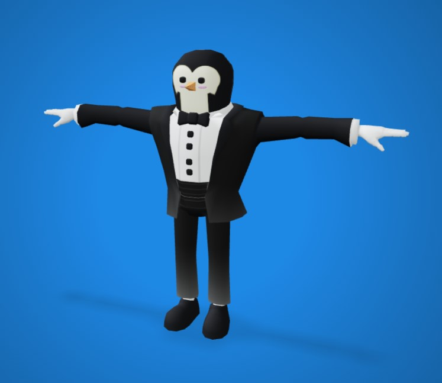
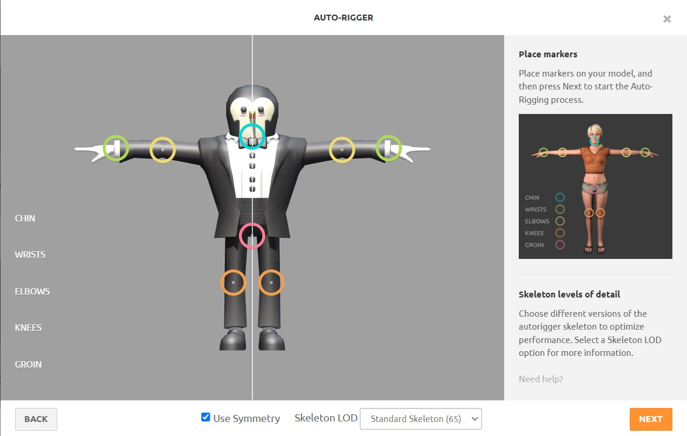
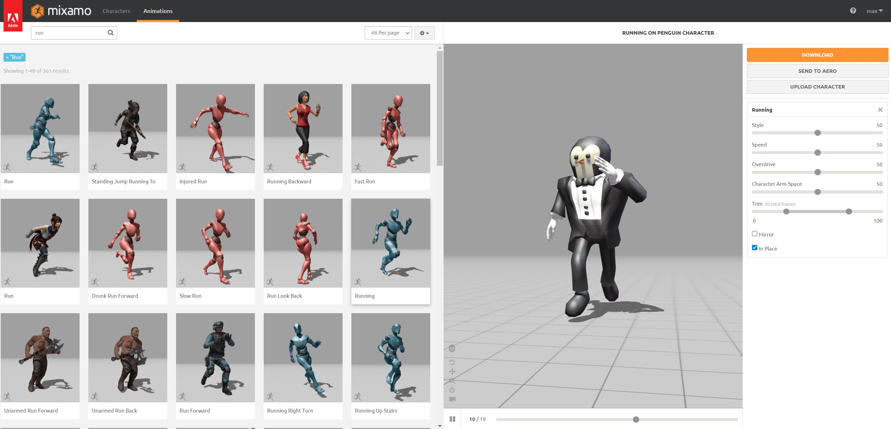
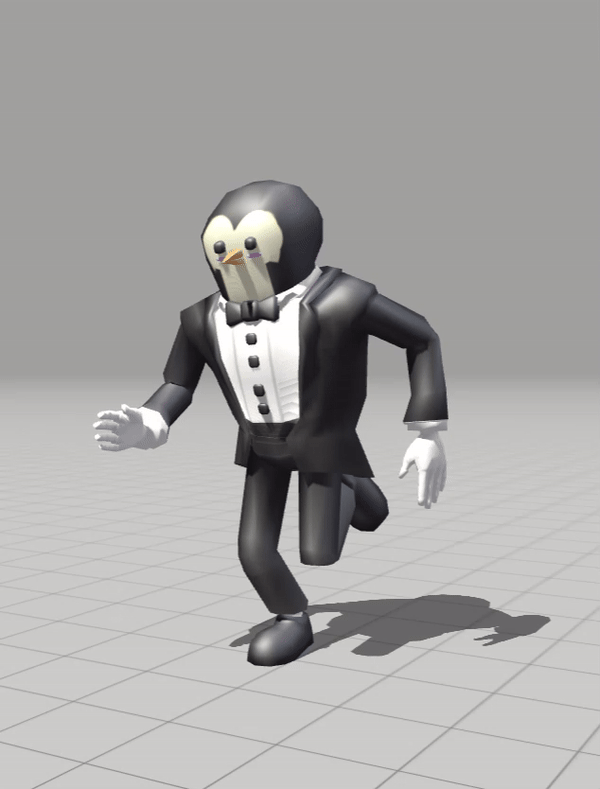

# Game Basic Information #

## Summary ##

The penguins are in trouble! Mischievous seals and bears are invading their icy home, trying to steal their fish reserves. As the leader of the penguin patrol, it’s up to you to build snow forts, fire snowball cannons, and unlock special abilities to protect the colony. But watch out! The seals and bears won’t give up easily! Get ready for a frosty adventure and defend the Arctic!

## Gameplay Explanation ##

**In this section, explain how the game should be played. Treat this as a manual within a game. Explaining the button mappings and the most optimal gameplay strategy is encouraged.**

**Add it here if you did work that should be factored into your grade but does not fit easily into the proscribed roles! Please include links to resources and descriptions of game-related material that does not fit into roles here.**

# Main Roles #

## Producer

**Describe the steps you took in your role as producer. Typical items include group scheduling mechanisms, links to meeting notes, descriptions of team logistics problems with their resolution, project organization tools (e.g., timelines, dependency/task tracking, Gantt charts, etc.), and repository management methodology.**

*Name: Cheng-yuan Liu*   
*Email: cgyliu@ucdavis.edu*   
*Github: *ccc2d8850

As the project producer, I maintained effective communication channels and project management practices throughout our development cycle. Our team primarily collaborated through a dedicated Discord channel, where we documented key technical discussions ranging from map terrain challenges to enemy animation implementations and turret integration specifics.
We have two crucial meetings: an initial planning session to align on roles and responsibilities, and a pre-deadline coordination meeting to ensure proper integration of all game functionalities. These meetings proved highly effective, particularly the final coordination session which helped us efficiently resolve outstanding integration issues.
For tracking project progress, I conducted weekly progress check-ins with team members, monitoring adherence to our initial gameplan timeline. While we experienced a slight delay in the final week, the team generally maintained good progress throughout development. The success of our source control workflow was particularly noteworthy, with minimal merge conflicts despite parallel development streams.

Project timeline (inside initial gameplan): https://docs.google.com/document/d/1GZWn_SmqQvAIgVN7532S8e85JhK0-5KoybL1oGKh4r8/edit?tab=t.0 

Progress report : https://docs.google.com/document/d/1KQmFBPK5jppJ9UUhGbMz5CHWgYjXk1dk-KPUlCqqudk/edit?tab=t.0

## User Interface and Input

*Name: Brian Nguyen*   
*Email: btinguyen@ucdavis.edu*   
*Github: briantinnguyen*

My primary task in the development of our tower defense game focused on the user interface and input, ensuring that the game was intuitive, responsive, and enjoyable for players. One of my first responsibilities was designing a wireframe for the layout, which served as a blueprint for the game's user interface. I started by mapping out the key elements the players would need to interact with during gameplay. The layout included elements like the enemy's spawn point, the road, the end road, and the overall design for the enemy path. This layout not only provided a clear structure for the game world but also helped guide groupmates in their respective task. 

I created the main menu, which serves as the starting point for the game. It provides options for starting a new game, loading, and quitting the game. I also created the pause menu that provides players with basic game session options. The menu includes the ability to resume the game or quit the game entirely. This menu enhances the overall user experience. 

 

In addition to designing the main and pause menus, I also implemented the game's top-down view and input controls. The top-down view was crucial for giving players a clear perspective of the tower defense game, this allows them to strategize effectively and place towers. I positioned the camera to ensure it captures the entire play while maintaining the game's arctic theme. For the input controls, I focused on creating a smooth experience for navigating the map. I implemented WASD camera movement, mouse scrolling for zoom, and camera boundary restriction to ensure the user doesn't go off the map. These controls were designed to be responsive and user-friendly.

## Movement/Physics

**Describe the basics of movement and physics in your game. Is it the standard physics model? What did you change or modify? Did you make your movement scripts that do not use the physics system?**

*Name: Penelope Phan*   
*Email: peaphan@ucdavis.edu*   
*Github: penelp

Movement:

The end objective for movement was to have only the enemy penguins to move down a fixed path, much like the game Bloons. To do this, I worked with Qihan in developing a durative command list to include, walking, running, attacking, left and right. I created the base code for the durative commands for all the movements and as you can see below, Qihan took over a portion of my role to edit my durative command scripts in order for them to work with the type of 3D animation models and bone models that we had, as they were quite finiicky to work with. The way the path is constructed is through a durative timer, indicating how long the zombie should walk to reach the end of the path. As you can see in ZombieWalkScript.gd, Me and Qihan worked together to work around how to deal with the 3D model, the solution we settled on was to have me create a set walk list according to the path that Maxim would create. The biggest hurdle I had with this was figuring out how to work out all the timers with the animations, since they wouldnt wait for one another to finish. I had decided to use both the timer, as well as a signal "complete"  being emitted from each movmement class after each animation was finished.

Much like Bloons, the enemies walk in a fixed spawn amount, with X amount of waves that the player has to fight through, for simplicity, we had chosen to do 2 waves. With the difficulty ramping up on second wave, by doubling the amount of enemies spawned from the first wave. Both the wave and the spawning system work on a timer, in which the player has to finish off the currently spawned enemies in order to start the new wave.

Physics:

The 3D models use a collisionBody3D that can be detected by the turrets implemented by Qihan, if the Zombies are able to reach the end of their path, the collision body will be detected by the wall's collision check, initiating a Game Over sequence. They are also able to take damage by decrementing the damage given by turrets using an area3d method check to measure if their body is in the turret lock group. My biggest issue from implementing the physics was dealing with the hierarchy that the zombie 3D model had, since making new hit and hurt boxes would affect the way the turret would target the zombie, so the hit box had to be attached to the base character3d body itself, with us doing away with the hurt box in favor of a insta lose once the zombies reach the castle.

## Animation and Visuals

### 3D Models and Assets
The objective for our 3D game was to create a visually cohesive experience where the characters, assets, and objects complemented each other seamlessly. As a team, we decided on an arctic-themed tower defense game in which penguins defend their precious supply of fish against waves of enemies, including seals and polar bears. From the outset, we envisioned a cartoonish, Roblox-inspired aesthetic—partially blocky, colorful, and intentionally unrealistic—to give the game an engaging arcade feel.

To bring this vision to life, I began searching for free-to-use assets online. During this process, I discovered [poly.pizza](https://poly.pizza/), a great resource offering thousands of free, high-quality poly 3D models. This platform became my go-to in sourcing most of the asset models for our game, from characters to environmental elements. By leveraging these assets, we were able to achieve a consistent and playful visual style that aligned with our creative direction and gameplay mechanics.

**List your assets, including their sources and licenses.**
With poly.pizza I was able to find many of the character models that we used for our game inluding:

* Penguin - https://poly.pizza/m/2GSHsxaDIo
* Turret - https://poly.pizza/m/ekTQhbJId7 
* Castle - https://poly.pizza/m/opTOmcN3o9 
* Igloo - https://poly.pizza/m/4CNw6ZPb4x3
* Tree - https://poly.pizza/m/3pWKPFASEn-

I downloaded these assets from poly.pizza as .glb files and imported them directly into our project under assets -> models. Here, other members of the group could use the assets for their portions of the game development. 

### Animation
I have limited experience animating 2D sprites and no prior experience animating 3D models or assets. However, I used a program called [Maximo](https://www.mixamo.com/), which simplifies the 3D animation process significantly. I started by importing a character asset from poly.pizza and positioned joints at key areas such as the knees, wrists, chin, and groin of the 3D model. Mixamo then automatically generated a skeleton with weights (rigs) and applied animations to the model.

Since Mixamo is designed for human-like characters, the animations are tailored to mimic human movements rather than animals. To work around this limitation, I selected a humanoid penguin character from poly.pizza to ensure the animations functioned correctly. Given the tight time constraints, this approach was the most efficient solution for animating the character.

If I had more time, I would have explored creating custom rigs and animations in Blender. This would have allowed me to animate non-humanoid characters, such as four-legged animals, expanding the possibilities for the game.

### Map/World-Building
**Describe how your work intersects with game feel, graphic design, and world-building. Include your visual style guide if one exists.**

When designing the map for our game, we decided to create a single, well-crafted map, as it aligned well with the mechanics and objectives of our tower defense gameplay. In most tower defense games, the map remains constant while the variables—such as the number of enemies, their difficulty, or their spawn frequency—change over time. Additionally, the map serves as a "sandbox" for players, providing a space where they can strategically place turrets and defenses to combat waves of enemies. Switching between maps as the game progresses would have disrupted this core gameplay loop and diminished the strategic depth we wanted to offer.

As I helped with the world-building, I was responsible for crafting the icy terrain and adding environmental details to bring our arctic theme to life. I used a Godot plugin called [Heightmap Terrain](https://godotengine.org/asset-library/asset/231) to sculpt the landscape, creating mountain ridges and hill-like terrain to serve as natural borders for the map. Beyond shaping the terrain, I positioned several 3D models, such as an igloo where the enemies spawn, a castle that the enemies are trying to attack, and other structures, to define the map's visual identity and strategic points. To enhance the game's overall feel, I incorporated smaller details like scattered trees, ice walls, and other environmental elements, creating a visually engaging and immersive arctic battlefield. These touches not only improved the map's aesthetic but also contributed to the game's atmosphere, making it more enjoyable and memorable for players.

*Name: Maxim Saschin*   
*Email: mnsaschin@ucdavis.edu*   
*Github: MaximSaschin*

## Game Logic

**Document the game states and game data you managed and the design patterns you used to complete your task.**

*Name: Qihan Guan*   
*Email: qgguan@ucdavis.edu*   
*Github: *

My role initially included handling the enemy and unit(turret) behaviors, but it became a broader role in the overall Game logic. I first implemented yaw rotation (horizontal) using basic vector math, using dot product to find the angle between the turret's forward vector and target vector, cross product's Y component, and using the sign to determine rotation direction (clockwise/counterclockwise). The next challenge was adding pitch rotation (vertical) and handling both axes concurrently and seamlessly with respect to the turret design. Which required me to change my initial approach from a simple vector-math based to a more complex approach that could handle both rotational axes simultaneously. Eventually, I learned that I could put separate pivot points on the turret model to handle the yaw rotations and pitch rotations separately. And use arctangent calculations for pitch angles. And implemented angle constraints for the turret's movements to remain realistic and within its design limitations.

After this, I spent time refining the turret movements, implementing more features/modes,  adding more debugging features, and making it more modular for other members to approach and modify. Then finally implementing it on the turret models provided by Maxim, it was a bit challenging as the model meshes only have two parts, the base and top. But I was able to make it work with some tricks.

Next, I implemented the durative movement commands for the enemies, initially, this was Penelope Phan's role but we decided to switch and she provided me with the initial template/implementation. But we didn't have our enemy model yet, So I found a Lego model to use as zombies and used Adobe Mixamo to do the auto-rigging. Getting this set up in Godot was trickier than I expected, I hadn't done much with animations/designs before, so I spent quite a bit of time figuring out how to properly structure the scene and model to work with the animations. The biggest headache was fixing issues where the meshes and skeleton transforms didn't line up correctly, especially during animations. Once I got past those hurdles I was able to use my experience from exercise 1 to implement the durative cmds scripts for the zombie movement. The main challenge was handling transitions during animation replays, especially for the walk animation. The starting position didn’t match the ending position, which caused a noticeable reset when the animation looped. After some time I  discovered I could disable translation to keep the character in place while playing the animation

disabling the transformation.

Then I work with Cheng Yuan to implement the building/town scripts. Given the time constraint, we decided to keep it simple. The research building passively upgrades turret attributes as long as its health remains above 20%. But only newly spawned turrets inherit these upgrades. The production building spawns turrets at predefined fortress points, tracking availability and only spawning at unoccupied locations.

*Name: Cheng-yuan Liu*   
*Email: cgyliu@ucdavis.edu*   
*Github: *ccc2d8850

I mainly focused on getting our buildings and management systems working. Here's what I worked on:
I started by making a template that all our buildings (resource, factory, wall, castle) could use. When that got a bit messy after some updates, I switched to putting all buildings under a town node instead, which worked better. The wall system ended up being part of the town too. I originally wanted to let players place turrets on wall mount points for more strategy options, but we changed plans and had to drop that feature.
I also created the game manager and testing scripts to handle things like starting/ending the game and managing resources. One of the trickiest parts was testing building features when we didn't have a playable game yet - it was hard to know how things would work after big changes. Another challenge was dealing with all the different nodes (mesh, collision, area) for each building. The mesh instances kept breaking for some reason, which made testing the scripts pretty frustrating.

#### assets:
Lego" (https://skfb.ly/MEGs) by Jody_Hong 
(http://creativecommons.org/licenses/by/4.0/). Rigging and animations by Adobe mixamo

# Sub-Roles

## Weapons System/ Debugging

*Name: Qihan Guan*   
*Email: qgguan@ucdavis.edu*   
*Github: *

My sub role is practically the same as my main, the general game logic and mechanics. This involves debugging scripts or fixing scenes.

## Audio

*Name: Penelope Phan*   
*Email: peaphan@ucdavis.edu*   
*Github: penelp

**List your assets, including their sources and licenses.**

Free music game loop bundle 
- https://tallbeard.itch.io/music-loop-bundle 

    License 
    
    - http://creativecommons.org/publicdomain/zero/1.0/

16 bit sound effects (planned for hit damage to wall) 
 - https://jdwasabi.itch.io/8-bit-16-bit-sound-effects-pack
  
    -No licenses listed but author: https://jdwasabi.itch.io/
  
Retro 32 bit game sounds for select and shoot
 - https://brainzplayz.itch.io/retro-sounds-32-bit 
    
    Licsense
     - https://itch.io/game-assets/assets-cc0

**Describe the implementation of your audio system.**

I plan to have background music playing throughout the game, the general theme is to just have the player's mind engaged since it's a bit of a slwo paced game, I wanted to choose faster paced music. I plan to implement the game sounds similar to Homework 1 implementations using the callback command to play a sound when an animation play. To reduce redundancy, I am planning to implement a death sound and a turret sound so that the sounds of enemies walking doesn't overwhelm the player.

**Document the sound style.** 

I decided to go for an 8-bit retro sound to the game, since when we first pitched the game being a Bloons-like game set in the snow, I wanted it to have a cutsey-arcade-like feel, with the 32-bit effects making the game sound colder, giving it a winter-y feel.

## Gameplay Testing

**Add a link to the full results of your gameplay tests.**

**Summarize the key findings from your gameplay tests.**

*Name: Maxim Saschin*   
*Email: mnsaschin@ucdavis.edu*   
*Github: *

## Narrative Design

**Document how the narrative is present in the game via assets, gameplay systems, and gameplay.** 

*Name: Cheng-yuan Liu*   
*Email: cgyliu@ucdavis.edu*   
*Github: *ccc2d8850

We kept the story pretty simple since the game is straightforward. Instead of having a detailed narrative, we let the arctic environment and assets (like igloos and penguins) tell the story. Players can jump right in and understand what's going on without needing much explanation. You'll find the basic background in our game summary, which gives players just enough context to know what they're fighting for.

## Game Feel and Polish

For game feel, one of the key improvements I made was addressing the brightness issue in the game. Initially, the game environment was too dark, which made it difficult for players to see the map and its contents. To fix this issue, I added a sun scene to enhance the lighting giving the game a more aesthetically pleasing environment. This fix not only improved visibility but it complemented the Arctic theme. This adjustment significantly enhanced the overall visual experience and ensured future gameplay was functional and enjoyable.

 

*Name: Brian Nguyen*   
*Email: btinguyen@ucdavis.edu*   
*Github: briantinnguyen*

## Press Kit and Trailer

**Include links to your presskit materials and trailer.**

When making the trailer for Pengine Patrol: Arctic Defense, I wanted to show off the main parts of the game in a fun and simple way. The trailer starts with a quick look at the icy Arctic and the penguin colony, then jumps into gameplay. You see snowball cannons firing, penguins building forts, and seals trying to steal fish. I made sure to include special moves, like icy blasts, to show how exciting the game gets. The trailer ends with a big call to action: "Protect the Arctic!"

I picked music that felt exciting and fun, adding sound effects like snowballs hitting seals to bring it to life. For the screenshots, I chose scenes that show the coolest parts of the game—penguins fighting back, seals charging in, and the icy Arctic world. I kept it simple, making sure everything looks fun and clear for anyone who sees it.

*Name: Brian Nguyen*   
*Email: btinguyen@ucdavis.edu*   
*Github: briantinnguyen*

# External Code, Ideas, and Structure #

If your project contains code that: 1) your team did not write, and 2) does not fit cleanly into a role, please document it in this section. Please include the author of the code, where to find the code, and note which scripts, folders, or other files that comprise the external contribution. Additionally, include the license for the external code that permits you to use it. You do not need to include the license for code provided by the instruction team.

If you used tutorials or other intellectual guidance to create aspects of your project, include reference to that information as well.

## Project Resources

[Web-playable version of your game.](https://itch.io/)  
[Trailor](https://youtube.com)  
[Press Kit](https://dopresskit.com/)  
[Proposal: make your own copy of the linked doc.](https://docs.google.com/document/d/1qwWCpMwKJGOLQ-rRJt8G8zisCa2XHFhv6zSWars0eWM/edit?usp=sharing)  
